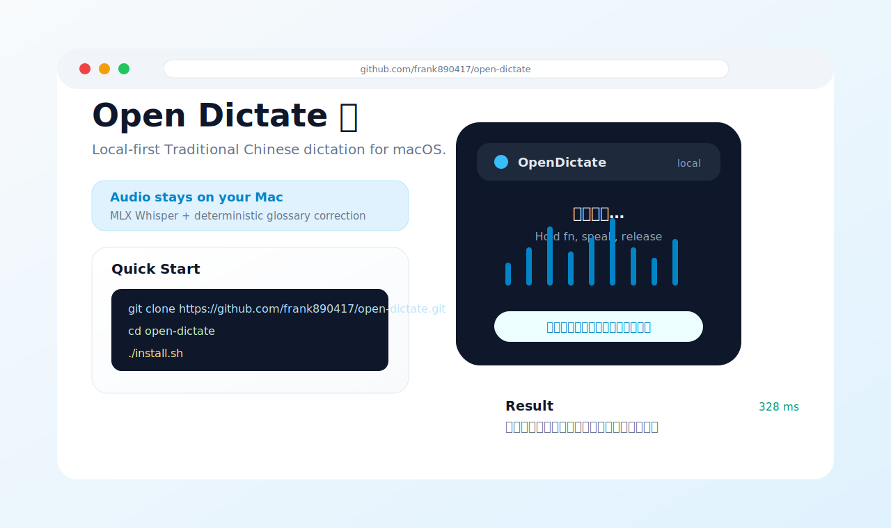

# Open Dictate 🎙️

**Local-first Traditional Chinese dictation for macOS.**

Hold a hotkey, speak, release, and Open Dictate inserts the transcribed sentence at your cursor. Audio is processed locally with MLX Whisper on Apple Silicon; correction is deterministic through user-owned glossary files.

| Area | Details |
|---|---|
| ASR | Local MLX Whisper `large-v3-turbo` keep-warm daemon |
| Privacy | Audio stays on your Mac; logs are local and git-ignored |
| Chinese | Traditional Chinese first, including full-width punctuation helpers |
| Correction | Deterministic glossary pairs; no sentence rewriting |
| UI | macOS menubar app with push-to-talk, HUD, settings, and recent entries |

Architecture and protocol: [`IO-CONTRACT.md`](IO-CONTRACT.md)



---

## Quick Start

```bash
git clone https://github.com/frank890417/open-dictate.git
cd open-dictate
./install.sh          # standalone install: creates .venv-dictate and uses vendor starter glossaries
open /Applications/OpenDictate.app
```

First-time permissions:

1. System Settings → Privacy & Security → enable OpenDictate for:
   - Accessibility
   - Input Monitoring
   - Microphone
2. If you use the `fn` hotkey: Keyboard → “Press 🌐 key to” → Do Nothing.
3. Click any text field, hold `fn`, speak, release.

Full setup: [`docs/SETUP.md`](docs/SETUP.md)

---

## Features

### Dictation

- Push-to-talk: `fn` or right Option.
- 16 kHz mono PCM16 recording → Python daemon → corrected text insertion.
- Short-press and silence gates reduce accidental hallucinations.
- Text insertion uses Accessibility direct insertion when possible, then paste fallback.
- Optional microphone selection.

### HUD and Menubar

- Recording waveform, timer, silence warning, transcribing status.
- Success preview with latency, raw text, and glossary changes.
- Recent entries, copy last text/raw, reload glossary, restart daemon.
- Settings window for hotkey, punctuation, injection mode, HUD, and mic.

### Glossary Loop

- Report a mishearing from the menubar.
- Teach selected text with a wrong → right pair.
- Starter glossaries live under `vendor/tools/td-subtitle/glossaries/`.
- Advanced users can point `OPEN_DICTATE_LEXICON_ROOT` to another glossary root with the same layout.

### Punctuation Modes

| Mode | Behavior |
|---|---|
| `smart_zh` | Deterministic Traditional Chinese punctuation and CJK spacing |
| `llm_zh` | Optional local Ollama punctuation pass with a no-rewrite gate |
| `raw` | Whisper output as-is |

---

## Architecture

```text
[Hotkey] → OpenDictate.app (record / HUD / insert)
              │ unix socket /tmp/open-dictate.sock
              ▼
         dictated.py (MLX keep-warm)
              │ deterministic lexicon correction
              ▼
         ~/.open-dictate/dictation-log/YYYY-MM-DD.jsonl
```

| Component | Path |
|---|---|
| Swift shell | `OpenDictate/` |
| Daemon | `daemon/dictated.py` |
| Starter glossaries | `vendor/tools/td-subtitle/glossaries/` |
| Lexicon engine | `vendor/tools/muse-lexicon/muse_lexicon.py` |
| Dictation log | `~/.open-dictate/dictation-log/` |
| Socket | `/tmp/open-dictate.sock` |

---

## Design Rules

1. Deterministic replacement only: glossary pairs may correct words; the system must not rewrite the sentence.
2. Prefer missed corrections over wrong corrections.
3. Traditional Chinese normalization is allowed; numeric meaning is not changed automatically.
4. Audio stays local.
5. UI must not steal focus from the current text field.

---

## Build and Test

```bash
./build.sh
python3 scripts/golden-bench.py --skip-daemon
./scripts/smoke-test.sh
```

The full smoke test builds the app, runs deterministic glossary tests, checks helper scripts, and verifies the signed app bundle.

---

## Status

Open Dictate is an early public seed extracted from a private daily-use tool. The core path works on Apple Silicon macOS, but packaging, naming, and CI are still young. Issues and pull requests are welcome.

## License

MIT. See [`LICENSE`](LICENSE).
